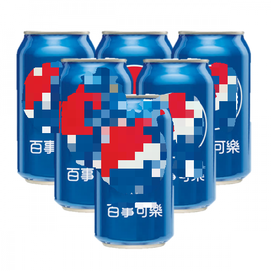
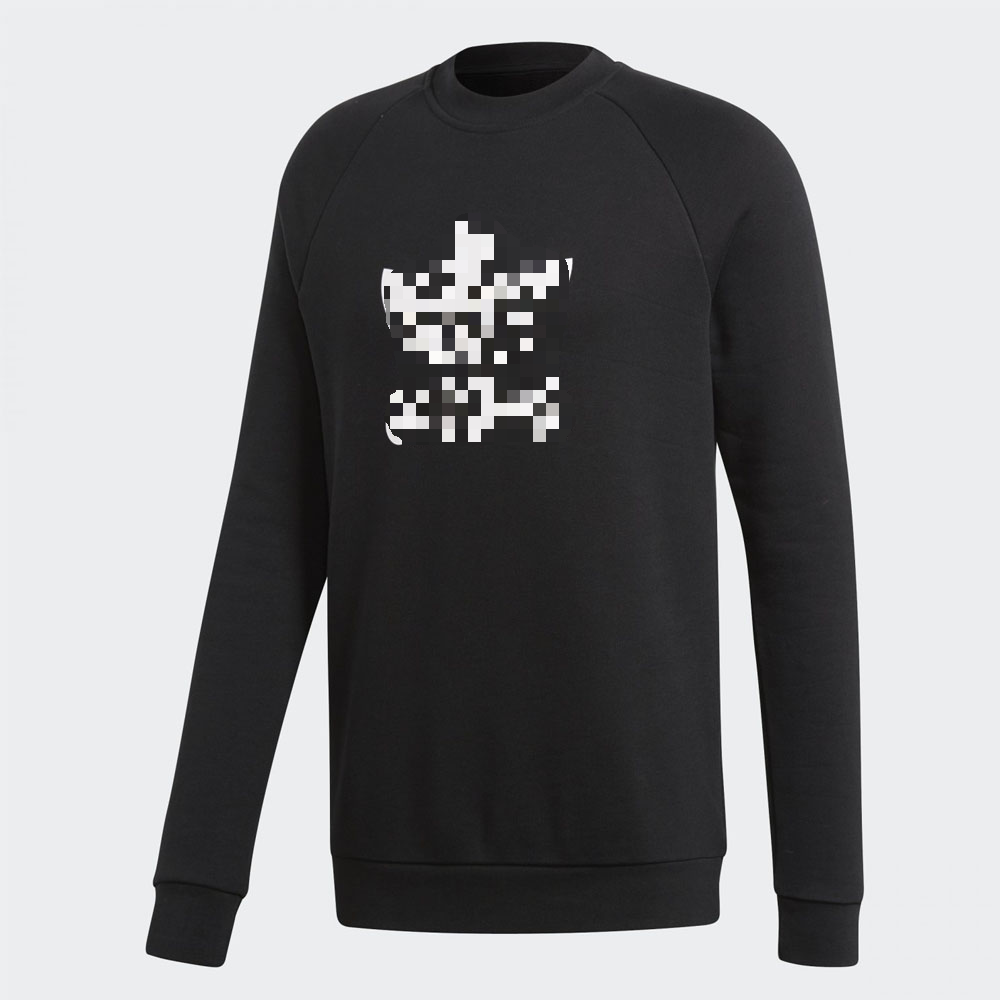
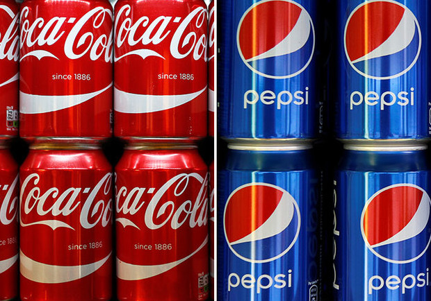
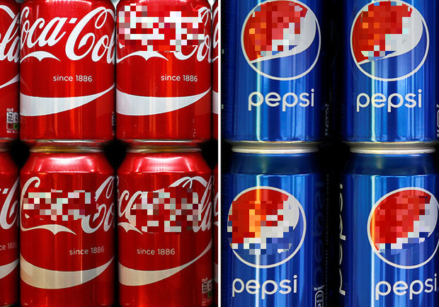

# Logo detection and mask based on Mask-RCNN
This is an implementation of Mask R-CNN on python 3, Keras, and Tensorflow. 
The model generates bounding boxes and segmentation masks for each instance of an object in the image. 
It's based on Feature Pyramid Network (FPN) and a ResNet101 backbone.

## Overview
Sponsored post  is widely used across various online media, such as youtube, Instagram, Facebook, etc. 
However, when these creators want to release their own work which is without sponsored post, there may be a lot of products in the videos or photos. 
They need to use mosaic to remove these product like Fig3. 
It will take a lot of time and effort in post-production. 
In order to reduce the hardship of people who are doing post-production, 
we want to build a network that can automatically remove the logos.

## Dataset -- FlickrLogos-47
There are 47 classes, and the images are from Flickr. 
It contains pixel-level annotations. 
If yout have interested in the dataset.
Please click on [FlickrLogos-47](http://www.multimedia-computing.de/flickrlogos/)

## Implementation
1. Training weights (You need to get the dataset first):

    Download the mask_rcnn_coco.h5 as the pre-train model. 
    ```
    wget https://github.com/matterport/Mask_RCNN/releases/download/v2.0/mask_rcnn_coco.h5
    ```
    Go to brands to implement the fine_tune_brands.py.
    ```
    cd samples/brands/
    python fine_tune_brands.py --gpu 0 
    ```
    After a while, you will get the mask_rcnn_brands.h5 in the same directionary with mask_rcnn_coco.h5.

2. Inference

    Copy or move the mask_rcnn_brands.h5 into block
    ```
    cd ../../
    cp mask_rcnn_brands.h5 block/
    ```
    Go to block and implement final_project.py
    ```
    cd block/
    python final_project.py -gpu 0 -i images/img7.jpg
    ```
    You will get an image called 'eraser.png' in the end.

## Results

<table border=1>

<tr>
<td>
<center>


</center>
</td>
</tr>

<tr>
<td>
<center>


</center>
</td>
</tr>
<tr>
<td>
<center>


</center>
</td>
</tr>


<tr>
<td>
<center>


</center>
</td>
</tr>

</table>